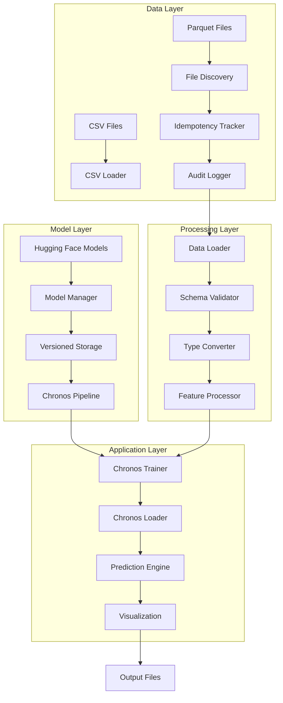
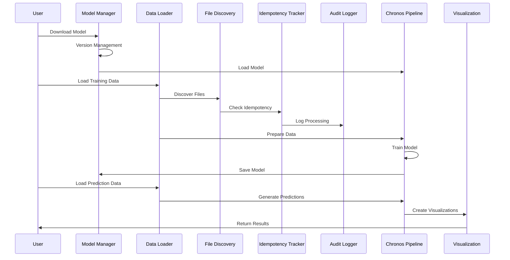

# Chronos Time Series Forecasting

A production-ready time series forecasting system built on Amazon's Chronos models with advanced parquet data loading capabilities and versioned model management.

## Overview

This project provides a comprehensive framework for time series forecasting using Chronos models, featuring:

- **Native Chronos Integration**: Direct integration with Chronos models without AutoGluon wrapper
- **Advanced Parquet Data Loading**: High-performance data loading with range-based discovery and idempotency
- **Versioned Model Management**: Complete model lifecycle management with versioning
- **Production-Ready Architecture**: Modular design with comprehensive error handling and audit logging

## Architecture

### System Architecture



### Data Flow Architecture



## Key Features

### 1. Parquet Data Loading System

Advanced parquet data loading with enterprise-grade features:

- **Range-based Discovery**: Load data for specific year/month ranges
- **Idempotency**: Automatic tracking prevents reprocessing of files
- **Audit Logging**: Complete trace of all processing activities
- **Schema Validation**: Comprehensive data quality checks
- **Performance Optimization**: Chunked loading and memory management


### 2. Model Management

Versioned model storage and management:

- **Multiple Model Sizes**: Support for all Chronos-Bolt variants
- **Version Control**: Complete model versioning system
- **Auto-Detection**: Automatic model availability detection
- **Backup/Restore**: Model backup and restoration capabilities

### 3. Native Chronos Integration

Direct integration with Chronos models:

- **Zero-shot Forecasting**: Immediate predictions without training
- **Fine-tuning**: Custom model training on specific datasets
- **Covariate Support**: Integration with external features
- **Uncertainty Quantification**: Probabilistic forecasting capabilities

## Installation

### Prerequisites

- Python 3.9+ (see [Python Update Guide](docs/006-python-update.md))
- Poetry for dependency management

### Quick Start

```bash
# Clone the repository
git clone <repository-url>
cd chronos-raw

# Install dependencies
poetry install

# Download a model
python src/download_chronos_model.py

# Run forecasting
python main.py
```

## Usage

### Basic Forecasting

```python
from src.chronos_trainer import ChronosTrainer
from src.chronos_loader import ChronosLoader

# Initialize trainer
trainer = ChronosTrainer()
trainer.load_training_data("data/raw/sample_data.csv")
trainer.train()

# Load model and predict
loader = ChronosLoader()
predictions = loader.predict(context_data)
```

### Parquet Data Loading

```python
from src.parquet_loader import ParquetDataLoader

# Initialize parquet loader
loader = ParquetDataLoader("config/parquet_loader_config.yaml")

# Load data for specific range
data = loader.load_training_data(
    symbol="SYMBOL",
    year_range=(2014, 2016),
    month_range=(1, 6)
)
```

### Model Management

```python
from src.model_manager import ModelManager

# List available models
manager = ModelManager()
models = manager.list_models()

# Switch model version
manager.switch_model("chronos-bolt-small", "v1.0")
```

## Configuration

### Model Configuration

```yaml
# config/settings.yaml
model:
  prediction_length: 48
  model_path: "data/model/chronos-bolt-base/v1.0"
  model_type: "chronos-bolt-base"
  version: "v1.0"
  loading_mode: "inference"
  auto_detect_mode: true
```

### Parquet Loader Configuration

```yaml
# config/parquet_loader_config.yaml
parquet_loader:
  data_paths:
    root_dir: "/path/to/parquet/data"
  
  file_patterns:
    naming_regex: "([A-Z]+)_([0-9]+min)_h([0-9]+)_([0-9]{4})_([0-9]{2})_([a-f0-9]+)\\.(parquet|json)$"
  
  schema:
    datetime_column: "ds"
    target_columns:
      - "target_bid_first"
      - "target_ask_first"
      - "target_close"
```

## Project Structure

```
chronos-raw/
├── src/                          # Source code
│   ├── parquet_loader/           # Parquet data loading system
│   │   ├── __init__.py
│   │   ├── loader.py             # Main ParquetDataLoader
│   │   ├── file_discovery.py     # File discovery and pattern matching
│   │   ├── idempotency.py        # Idempotency tracking
│   │   ├── audit.py              # Audit logging
│   │   ├── config.py             # Configuration management
│   │   └── exceptions.py         # Custom exceptions
│   ├── base_model.py             # Base model management
│   ├── train_model.py            # Model training
│   ├── load_model.py             # Model loading and inference
│   ├── model_manager.py          # Model version management
│   └── download_chronos_model.py # Model downloader
├── data/                         # Data storage
│   ├── raw/                      # Raw input data
│   ├── processed/                # Processed data
│   ├── predictions/              # Forecast outputs
│   └── model/                    # Versioned model storage
│       └── chronos-bolt-base/
│           └── v1.0/
├── config/                       # Configuration files
│   ├── settings.yaml
│   └── parquet_loader_config.yaml
├── docs/                         # Documentation
└── main.py                       # Main execution script
```

## Supported Models

| Model | Parameters | Speed | Accuracy | Use Case |
|-------|------------|-------|----------|----------|
| chronos-bolt-tiny | 9M | Fastest | Basic | Quick prototyping |
| chronos-bolt-mini | 21M | Fast | Good | Balanced performance |
| chronos-bolt-small | 48M | Medium | Better | Production use |
| chronos-bolt-base | 205M | Slower | Best | High accuracy needs |

## Data Formats

### CSV Format (Traditional)
```csv
timestamp,value,item_id
2020-01-01,100.5,series_1
2020-01-02,102.3,series_1
```

### Parquet Format (Recommended)
```
data/parquet/
├── 2014/
│   ├── 01/
│   │   └── SYMBOL_1min_h15_2014_01_769b531dbb2ff3cb.parquet
│   └── 02/
└── 2015/
    └── 01/
```

## Performance Features

### Memory Optimization
- Chunked loading for large datasets
- Type optimization (float32 vs float64)
- Lazy loading of required columns only
- Caching of intermediate results

### Parallel Processing
- Multi-threaded file reading
- Parallel feature engineering
- Concurrent data quality checks

### Storage Optimization
- Partitioned parquet files by date
- Snappy compression
- Column pruning for efficiency

## Error Handling

Comprehensive error handling with custom exception hierarchy:

- `ParquetLoaderError`: Base exception class
- `ConfigError`: Configuration-related errors
- `DataNotFoundError`: Missing data errors
- `InvalidFilenameError`: Filename pattern mismatches
- `DataQualityError`: Data validation failures
- `SchemaValidationError`: Schema compliance issues

## Monitoring and Observability

### Data Quality Metrics
- Missing value rates by column
- Outlier detection rates
- Temporal gap analysis
- Schema compliance scores

### Performance Metrics
- Loading time per file size
- Memory usage patterns
- Cache hit rates
- Processing throughput

### Business Metrics
- Data freshness (time since last update)
- Feature completeness scores
- Prediction accuracy correlation

## Development

### Code Quality
- Pre-commit hooks with Black and Flake8
- Type hints throughout codebase
- Comprehensive error handling
- Modular, testable architecture

### Testing
- Unit tests for all components
- Integration tests with sample data
- Performance testing with large datasets
- Error scenario testing

## Documentation

- [Usage Guide](docs/USAGE.md) - Complete usage instructions
- [Implementation Guide](docs/03A-implementation.md) - Development checklist
- [Parquet Design](docs/03-load-parquet.md) - Parquet loader architecture
- [Native Development](docs/02-chronos-native-dev.md) - Chronos integration design

## Contributing

1. Fork the repository
2. Create a feature branch
3. Make your changes
4. Add tests for new functionality
5. Ensure all tests pass
6. Submit a pull request

## License

[Add your license information here]

## Acknowledgments

- Amazon Research for the Chronos models
- Hugging Face for model hosting and distribution
- The open-source community for various dependencies

---

For detailed usage instructions, see the [Usage Guide](docs/USAGE.md).
